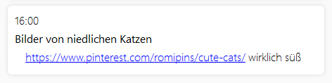

# Task Management App


Task Management App ist ein Python-Projekt zum Verwalten von Aufgaben und Erinnerungen.
Dies ist das Abschlussprojekt für das Modul "Einführung in die Programmierung".

## Installation
Das Programm wurde mit [Python3](https://www.python.org/downloads/) entwickelt und benutzt die 
die Bibliothek "PySide2". Sie kann mit pip installiert werden: `python3 -m pip install PySide2`.

Mit dem Befehl `python3 main.py` kann die App ausgeführt werden.

Ein Fehler, der bei mir anfangs auf Ubuntu auftrat:  
`qt.qpa.plugin: could not load Qt platform plugin "xcb" in "" even though it was found`  
ließ sich für mich mit `sudo apt-get install --reinstall libxcb-xinerama0` beheben

## Bedienung

Mit dem Programm kann man Aufgaben und Erinnerungen als kleine Notizen anlegen, die dann in einer Zeitleiste aufgelistet werden.
Wird eine Notiz nicht mehr gebraucht, dann kann sie als erledigt markiert werden oder gelöscht werden.

#### Aufgaben anlegen
Mit dem "+" Knopf in der oberen blauen Leiste öffnet sich ein Formular, um eine neue Aufgabe zu erstellen.  

Eine Aufgabe braucht immer einen Titel und ein Datum.
Es kann auch eine Beschreibung hinzugefügt werden und ausgewählt werden, ob sie ganztags oder zu einer bestimmten Uhrzeit stattfindet.
Außerdem kann jede Aufgabe einem Projekt zugeordnet werden (siehe Optionale Features).


Sobald die Notiz mit "Save" gespeichert wird, ist sie in der Zeitleiste zu sehen. 
Die Beschreibung klappt sich unter dem Titel aus und ein, wenn man auf die Notiz klickt.

#### Aufgaben bearbeiten, erledigen, löschen
Wenn man mit der Maus über eine Aufgabe fährt, werden die Knöpfe zum Bearbeiten der Aufgabe sichtbar.

* Der Knopf mir dem Stift-Icon öffnet wieder das Formular, damit Änderungen gemacht werden können.
* Der "Completed"-Knopf markiert eine Aufgabe als erledigt und graut sie aus. Mit einem zweiten Klick auf den Knopf kann dies wieder rückgängig gemacht werden.
Erledigte Aufgaben können auch temporär ausgeblendet werden mit dem "Hide completed"-Kontrollkästchen in der oberen Leiste.

* Der Mülleimer-Knopf löscht eine Aufgabe permanent, was nicht rückgängig gemacht werden kann.

#### Aufgaben speichern und laden
Aufgaben und Projekte werden immer automatisch in einem Ordner "TaskManagementApp" im Benutzer Home-Verzeichnis abgespeichert.


## Optionale Features
Aus dem Pool der optionalen Features habe ich mir
* die Zuordnung von Aufgaben zu Projekten und
* die Bedienung des Programms über ein Command-Line-Interface

ausgesucht.

#### Projekte

Projekte können ähnlich wie Notizen in der linken Seitenleiste erstellt werden.
Der "+" Knopf mit dem Kreis herum, öffnet das Formular zum Erstellen eines Projektes.   Jedes Projekt braucht einen eindeutigen Namen und kann eine Farbe haben.

Genauso wie Aufgaben können Projekte mit Knöpfen, die beim Hinüberfahren erscheinen, bearbeitet oder gelöscht werden.


Öffnet man nun das Bearbeitungsformular einer Aufgabe, kann die Aufgabe dort einem Projekt zugeordnet werden. 
Die Zuordnung wird dann sichtbar gemacht, in dem das Icon des Projektes auf der Notiz in der Zeitleiste angezeigt wurd.

Um sich nur die Aufgaben eines Projektes anzeigen zu lassen, kann man auf den Namen eines Projektes klicken.
Dann werden alle Aufgaben ohne Projekt oder anderer Projekte ausgeblendet. 
Mit dem "Show all tasks" Knopf werden wieder alle Aufgaben angezeigt.

#### CLI

Befehle des Command-Line-Interfaces können mit `python3 main.py` und dem Namen eines Unterbefehls dahinter ausgeführt werden.

Hier ist eine Übersicht aller Befehle:
```
task                    
    list                Lists all tasks with an index, optionally filters tasks of a project or uncompleted tasks
    create              Creates a new task
    edit                Edits the passed properties of a task
    complete            Sets the completion state of a task
    delete              Deletes a task
    
project                 
    list                Lists all projects
    create              Creates a new project
    rename              Renames a project
    delete              Deletes a project
```
Viele der untersten Befehle besitzen feste oder optionale Argumente. 
Die genaue Verwendung jedes Befehls kann mit `[command] -h` eingesehen werden.

##### Beispiele:
Der Befehl `python3 main.py task list` z.B. listet alle Aufgaben in der Konsole auf: 
```
-------------------- Samstag, 13. März --------------------
1  11:00
   [Done] Gemüse einkaufen
      Paprika, Lauch, Zwiebeln, Kartoffeln
-------------------- Mittwoch, 17. März --------------------
2  14:00
   Opa Fridolin anrufen   (Familie&Freunde)
-------------------- Freitag, 2. April --------------------
3  Bib Buch zurückgeben   (Uni)
      Mathematik für Ingenieure und Naturwissenschaftler Band 1

```
Der Index einer Aufgabe in dieser Liste kann in anderen Befehlen verwendet werden, 
um zum Beispiel den Einkauf am Samstag an einen anderen Tag zu verschieben: `python3 main.py task edit 1 --date 23.3.`

Daraufhin steht diese Aufgabe an einer anderen Stelle in der Liste:
```
-------------------- Dienstag, 23. März --------------------
2  11:00
   [Done] Gemüse einkaufen
      Paprika, Lauch, Zwiebeln, Kartoffeln
```

## Sonstiges

In Aufgabenschreibungen werden Links, die beispielsweise ".com" oder ".de" enthalten, automatisch in anklickbare Hypelinks umgewandelt:


